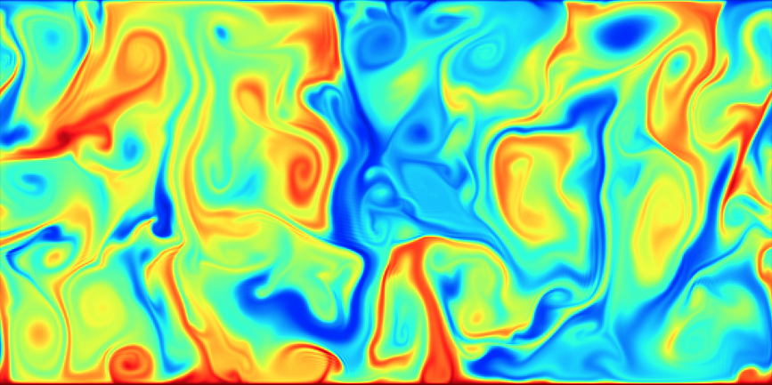
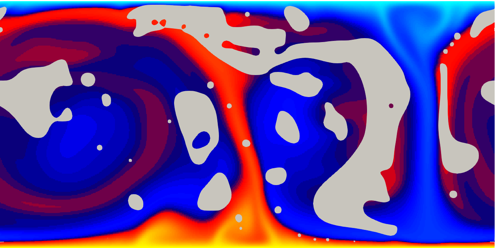

## Multiphase Rayleigh-Benard 
Code for phase-field simulations in Rayleigh-Bénard configuration (2D).
Numerical scheme: Finite difference-based (FD2)

#Time integration
- Temperature: SSP-RK3 + CN for Temperature along y (flag)
- Navier-Stokes: RK3
- Phase-field: RK3 (to be implemented)
- NS: Fractional method, Poisson solver based on FFT (along x - periodic) + TDMA (y, walls).

## Check list of features implemented (or to be implemented)

- Poisson solver (Matlab) ✅
- Poisson solver validation (Matlab) ✅
- Poisson solver convergence (Matlab) ✅
- Poisson solver (Fortran: FFT forth and back) ✅
- Poisson solver (Fortran) ✅
- Added support for stretched nodes along z (Matlab only, easy to move in Fortan) ✅
- Introduced phi ✅ 
- Introduced temperature ✅ 
- Introduced temporal loop ✅ 
- Navier-Stokes solution ✅ 
- Validation (phi) ✅ 
- Validation (temp) ✅ 
- Validation (NS): Channel flow (pressure-driven + wall-driven) ✅
- RB setup ✅ 
- GPU offloading of entire code  ✅
- TDMA optimization (x 10 speed-up)  ✅

## Validation  
- Aspect ratio: 2
- Ra from 1e3 to 1e9 + Pr=1
- Grid: 512 x 256

## Example of single-phase RBC (Ra=1e9 + Pr=1)

## Example of multiphase RBC (Ra=1e7 + Pr=1)

## Performance and resolution tested

- 512 x 256 - 2.5 ms/iter - RTX5000 16GB (NS + Temp exp. + phase-field)
- 512 x 256 - 0.7 ms/iter - A100 64GB (NS + Temp exp. + phase-field)
- 2048 x 1024 - 19 ms/iter - RTX5000 16GB (NS + Temp exp.)
- 4096 x 2048 - 70 ms/iter - RTX5000 16GB (NS + Temp exp.)

## Grid points (staggered)

