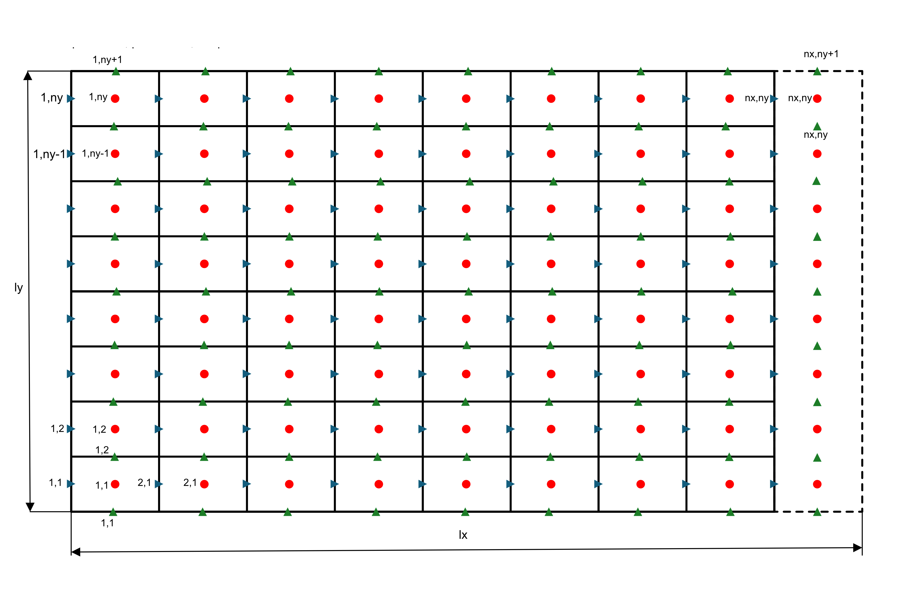

## NEMESI36
2D code for PFM simulations (WIP)

## Check list of features implemented (or to be implemented)

- Poisson solver (Matlab) ✅
- Poisson solver validation (Matlab) ✅
- Poisson solver convergence (Matlab) ✅
- Poisson solver (Fortran: FFT forth and back) ✅
- Poisson solver (Fortran) ✅
- Added support for stretched nodes along z (Matlab only, easy to move in Fortan) ✅
- Introduced phi ✅ 
- Introduced temperature ✅ 
- Introduced temporal loop ✅ 
- Navier-Stokes solution ✅ 
- Validation (phi) 🚧 
- Validation (temp) 🚧
- Validation (NS) 🚧
- RB setup
- GPU offloading of entire code (only Poisson ATM)

## Grid p🚧oints (staggered)

