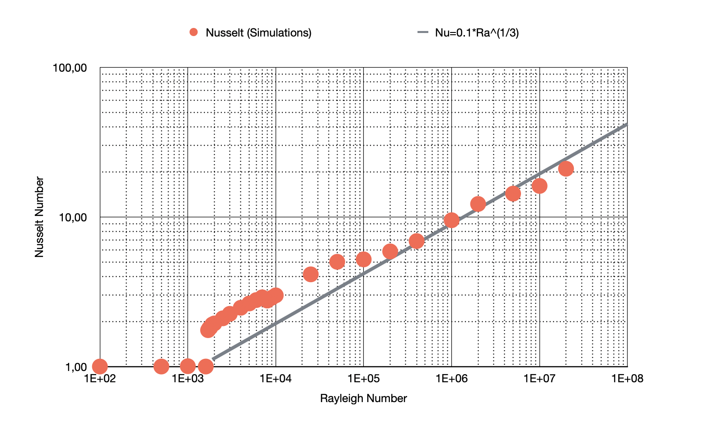
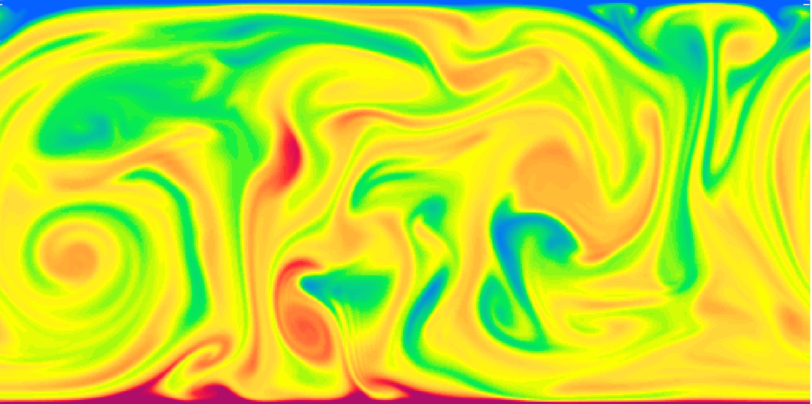

## Multiphase Rayleigh-Benard 
2D code for Phase-field simulation in Rayleigh-Bénard configurtion 
Finite difference-based 
Temperature and phase-field fully explicit 
Poissono solver based on FFT (along x - periodic) + TDMA (y, walls).

## Check list of features implemented (or to be implemented)

- Poisson solver (Matlab) ✅
- Poisson solver validation (Matlab) ✅
- Poisson solver convergence (Matlab) ✅
- Poisson solver (Fortran: FFT forth and back) ✅
- Poisson solver (Fortran) ✅
- Added support for stretched nodes along z (Matlab only, easy to move in Fortan) ✅
- Introduced phi ✅ 
- Introduced temperature ✅ 
- Introduced temporal loop ✅ 
- Navier-Stokes solution ✅ 
- Validation (phi) ✅ 
- Validation (temp) ✅ 
- Validation (NS): Channel flow (pressure-driven + wall-driven) ✅
- RB setup ✅ 
- GPU offloading of entire code  ✅
- TDMA optimization (x 10 speed-up)  ✅
- Some kernels can be improved (from profile, 1.5x/2.0x overall potential speed-up) 🚧

## Validation  
- Aspect ratio: 2
- Ra from 1e3 to 1e8 + Pr=1
- Grid: 512 x 256

## RBC (Ra=1e8 + Pr=1)

## Performance and resolution tested

- 2048 x 1024 - 22 ms/iter - RTX5000 16GB
- 4096 x 2048 - 80 ms/iter - RTX5000 16GB

## Grid points (staggered)

